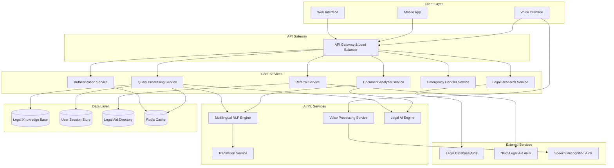

# Design Document: AI-Powered Legal Assistance Platform

## Overview

The AI-Powered Legal Assistance Platform is a comprehensive multilingual system that democratizes access to legal information for common citizens. The platform combines advanced natural language processing, voice recognition, and legal knowledge bases to provide accessible legal guidance while maintaining clear ethical boundaries.

The system architecture follows a microservices approach with specialized components for multilingual processing, voice interaction, document analysis, emergency handling, and legal aid referrals. The platform emphasizes user privacy, data security, and clear disclaimers about the limitations of AI-generated legal advice.

Key design principles include:
- **Accessibility First**: Multilingual support with voice and text interfaces
- **Privacy by Design**: Anonymous access with secure data handling
- **Clear Boundaries**: Prominent disclaimers and limitations
- **Emergency Responsiveness**: Priority handling for urgent legal matters
- **Community Connection**: Integration with legal aid and NGO services

## Architecture

The platform uses a distributed microservices architecture deployed on cloud infrastructure with the following high-level components:



## Components and Interfaces

### 1. API Gateway and Load Balancer
**Purpose**: Entry point for all client requests with routing, rate limiting, and security
**Key Interfaces**:
- REST API endpoints for web/mobile clients
- WebSocket connections for real-time chat
- Voice streaming endpoints for audio processing

### 2. Authentication Service
**Purpose**: Manages user sessions while supporting anonymous access
**Key Interfaces**:
```typescript
interface AuthService {
  createAnonymousSession(): SessionToken
  validateSession(token: SessionToken): SessionInfo
  extendSession(token: SessionToken): void
  terminateSession(token: SessionToken): void
}
```

### 3. Query Processing Service
**Purpose**: Core service for handling legal questions and generating responses
**Key Interfaces**:
```typescript
interface QueryProcessor {
  processQuery(query: LegalQuery, context: SessionContext): Promise<LegalResponse>
  maintainContext(sessionId: string, query: LegalQuery): void
  detectEmergency(query: LegalQuery): EmergencyLevel
}

interface LegalQuery {
  text: string
  language: LanguageCode
  isVoice: boolean
  sessionId: string
  timestamp: Date
}

interface LegalResponse {
  answer: string
  language: LanguageCode
  disclaimers: string[]
  sources: LegalSource[]
  suggestedActions: string[]
  isEmergency: boolean
  audioResponse?: AudioData
}
```

### 4. Multilingual NLP Engine
**Purpose**: Processes legal text in multiple languages with legal terminology understanding
**Key Interfaces**:
```typescript
interface MultilingualNLP {
  analyzeIntent(text: string, language: LanguageCode): LegalIntent
  extractEntities(text: string, language: LanguageCode): LegalEntity[]
  classifyUrgency(text: string, language: LanguageCode): UrgencyLevel
  simplifyLegalText(text: string, language: LanguageCode): string
}
```

### 5. Voice Processing Service
**Purpose**: Handles speech-to-text and text-to-speech with legal terminology
**Key Interfaces**:
```typescript
interface VoiceProcessor {
  transcribeAudio(audio: AudioData, language: LanguageCode): Promise<string>
  synthesizeSpeech(text: string, language: LanguageCode): Promise<AudioData>
  detectLanguage(audio: AudioData): LanguageCode
}
```

### 6. Document Analysis Service
**Purpose**: Analyzes uploaded legal documents and extracts key information
**Key Interfaces**:
```typescript
interface DocumentAnalyzer {
  analyzeDocument(document: DocumentData): Promise<DocumentAnalysis>
  extractClauses(document: DocumentData): LegalClause[]
  identifyRisks(document: DocumentData): RiskAssessment[]
  generateSummary(document: DocumentData, language: LanguageCode): string
}

interface DocumentAnalysis {
  documentType: string
  keyClauses: LegalClause[]
  riskAssessment: RiskAssessment[]
  summary: string
  recommendations: string[]
  language: LanguageCode
}
```

### 7. Emergency Handler Service
**Purpose**: Prioritizes and handles urgent legal matters
**Key Interfaces**:
```typescript
interface EmergencyHandler {
  assessUrgency(query: LegalQuery): EmergencyLevel
  generateEmergencyResponse(query: LegalQuery): EmergencyResponse
  getEmergencyContacts(jurisdiction: string, legalArea: string): EmergencyContact[]
}

interface EmergencyResponse {
  immediateActions: string[]
  timeConstraints: TimeConstraint[]
  emergencyContacts: EmergencyContact[]
  legalDeadlines: LegalDeadline[]
}
```

### 8. Legal Aid Referral Service
**Purpose**: Connects users with appropriate legal aid organizations and NGOs
**Key Interfaces**:
```typescript
interface ReferralService {
  findLegalAid(criteria: ReferralCriteria): Promise<LegalAidOption[]>
  checkEligibility(userInfo: UserInfo, service: LegalAidOption): EligibilityResult
  generateReferralPackage(user: UserInfo, service: LegalAidOption): ReferralPackage
}

interface ReferralCriteria {
  legalArea: string
  jurisdiction: string
  incomeLevel?: string
  urgency: UrgencyLevel
  language: LanguageCode
}
```

## Data Models

### Core Data Structures

```typescript
// User and Session Management
interface SessionContext {
  sessionId: string
  language: LanguageCode
  isAnonymous: boolean
  conversationHistory: LegalQuery[]
  jurisdiction?: string
  createdAt: Date
  lastActivity: Date
}

// Legal Knowledge Representation
interface LegalKnowledge {
  id: string
  jurisdiction: string
  legalArea: string
  content: MultilingualContent
  sources: LegalSource[]
  lastUpdated: Date
  reliability: number
}

interface MultilingualContent {
  [languageCode: string]: {
    title: string
    content: string
    summary: string
  }
}

// Document Processing
interface DocumentData {
  id: string
  filename: string
  content: Buffer
  mimeType: string
  language: LanguageCode
  uploadedAt: Date
}

interface LegalClause {
  id: string
  type: ClauseType
  content: string
  riskLevel: RiskLevel
  explanation: string
  recommendations: string[]
}

// Emergency and Referral Data
interface EmergencyContact {
  organization: string
  contactInfo: ContactInfo
  jurisdiction: string
  specialties: string[]
  availability: AvailabilityInfo
}

interface LegalAidOption {
  id: string
  organizationName: string
  type: OrganizationType // NGO, Legal Aid, Pro Bono
  services: string[]
  eligibilityCriteria: EligibilityCriteria
  contactInfo: ContactInfo
  languages: LanguageCode[]
  jurisdiction: string
  rating: number
}

// Enums and Types
enum LanguageCode {
  EN = 'en',
  ES = 'es',
  FR = 'fr',
  DE = 'de',
  ZH = 'zh',
  HI = 'hi',
  AR = 'ar',
  PT = 'pt',
  RU = 'ru',
  JA = 'ja'
}

enum EmergencyLevel {
  LOW = 'low',
  MEDIUM = 'medium',
  HIGH = 'high',
  CRITICAL = 'critical'
}

enum RiskLevel {
  LOW = 'low',
  MEDIUM = 'medium',
  HIGH = 'high',
  CRITICAL = 'critical'
}
```

### Database Schema Design

The platform uses a combination of relational and document databases:

**PostgreSQL** for structured data:
- User sessions and preferences
- Legal aid organization directory
- Emergency contacts and resources
- System configuration and metadata

**MongoDB** for document storage:
- Legal knowledge base with multilingual content
- Document analysis results
- Conversation histories (temporary)
- Legal research cache

**Redis** for caching and session management:
- Active user sessions
- Frequently accessed legal information
- Rate limiting data
- Real-time conversation state

## Correctness Properties

*A property is a characteristic or behavior that should hold true across all valid executions of a system—essentially, a formal statement about what the system should do. Properties serve as the bridge between human-readable specifications and machine-verifiable correctness guarantees.*

Based on the prework analysis, I've identified several redundant properties that can be consolidated:

**Property Reflection:**
- Properties 1.2 and 5.2 both test disclaimer inclusion - can be combined into one comprehensive disclaimer property
- Properties 1.4, 2.4, and 4.3 all test plain language usage - can be combined into one language simplification property  
- Properties 2.5 and 6.3 both test data deletion - can be combined into one data cleanup property
- Properties 6.1, 6.2, and 6.4 can be combined into one comprehensive security property
- Properties 7.1, 7.2, and 7.3 can be combined into one response quality property

### Property 1: Multilingual Response Consistency
*For any* legal query submitted in a supported language, the system response should be in the same language and delivered within the specified time limit (30 seconds for normal queries, 10 seconds for emergency queries).
**Validates: Requirements 1.1, 8.1**

### Property 2: Universal Disclaimer Inclusion
*For any* legal guidance or advice provided by the system, the response should include appropriate disclaimers and liability limitations in the user's language.
**Validates: Requirements 1.2, 5.2, 5.5**

### Property 3: Out-of-Scope Query Handling
*For any* query that falls outside the system's capabilities, the response should clearly state limitations and recommend consulting qualified legal counsel.
**Validates: Requirements 1.3, 5.3**

### Property 4: Plain Language Communication
*For any* legal information presented to users, the system should provide plain language explanations appropriate for common citizens, with readability scores meeting accessibility standards.
**Validates: Requirements 1.4, 2.4, 4.3**

### Property 5: Voice Processing Round-Trip
*For any* voice input, transcribing to text and then synthesizing back to speech should preserve the essential meaning and legal terminology accuracy.
**Validates: Requirements 1.5**

### Property 6: Conversation Context Preservation
*For any* follow-up question within a session, the system should maintain relevant context from previous interactions regardless of input method (text or voice).
**Validates: Requirements 1.6**

### Property 7: Document Processing Capability
*For any* uploaded document in supported formats (PDF, DOC, DOCX, TXT) up to 50MB, the system should successfully process and analyze the document.
**Validates: Requirements 2.1**

### Property 8: Document Analysis Completeness
*For any* analyzed legal document, the results should include key terms identification, clause extraction, risk assessment, and a comprehensive summary.
**Validates: Requirements 2.2, 2.3**

### Property 9: Secure Data Lifecycle Management
*For any* user data (documents, queries, session information), the system should encrypt data in transit and at rest, limit storage duration to session requirements, and securely delete data upon session termination.
**Validates: Requirements 2.5, 6.1, 6.2, 6.3**

### Property 10: Legal Research Result Organization
*For any* research query, returned results should be organized by relevance and jurisdiction, with proper formatting for case law (summaries, holdings, citations) and statutes (current versions, amendments).
**Validates: Requirements 3.1, 3.2, 3.3, 3.4**

### Property 11: Search Filtering Functionality
*For any* research query with applied filters (jurisdiction, date range, legal area), the results should only include items matching all specified criteria.
**Validates: Requirements 3.5**

### Property 12: User Interface Responsiveness
*For any* device type (desktop, tablet, mobile), the user interface should maintain functionality and accessibility, adapting layout appropriately to screen size and input capabilities.
**Validates: Requirements 4.5**

### Property 13: Contextual Help Availability
*For any* user interaction with legal terminology or complex features, appropriate tooltips, help content, and FAQ sections should be available in the user's selected language.
**Validates: Requirements 4.2, 4.4**

### Property 14: Access Control Enforcement
*For any* system access attempt, role-based access controls should be enforced, allowing only authorized personnel to access administrative functions while maintaining anonymous user access for legal assistance features.
**Validates: Requirements 6.4**

### Property 15: Response Quality and Source Attribution
*For any* legal response containing factual claims, the system should cite authoritative sources, specify applicable jurisdiction when relevant, and verify citation accuracy for case law references.
**Validates: Requirements 7.1, 7.2, 7.3**

### Property 16: Uncertainty Expression
*For any* legal query where the system has low confidence or encounters ambiguous information, the response should explicitly express uncertainty and recommend professional consultation.
**Validates: Requirements 7.4**

### Property 17: Emergency Response Prioritization
*For any* query identified as an emergency situation, the system should provide specific immediate action guidance, relevant emergency contacts, and clear explanation of time-sensitive legal requirements.
**Validates: Requirements 8.2, 8.3, 8.4**

### Property 18: Legal Aid Referral Completeness
*For any* request for professional legal help, the referral system should provide organized lists of relevant legal aid organizations with complete information including contact details, application processes, eligibility requirements, and required documentation.
**Validates: Requirements 9.1, 9.2, 9.4**

### Property 19: Pro Bono Prioritization
*For any* user qualifying for free legal services based on eligibility criteria, pro bono and legal aid options should be prioritized over paid services in referral results.
**Validates: Requirements 9.3**

### Property 20: Performance Under Load
*For any* system load condition, the platform should maintain core functionality, meet response time requirements for 95% of requests during normal operation, and provide clear communication about any service delays during high load periods.
**Validates: Requirements 10.1, 10.2**

### Property 21: Error Recovery
*For any* system error or exception, users should receive clear error messages with actionable recovery options, and the system should gracefully handle failures without data loss.
**Validates: Requirements 10.5**

## Error Handling

The platform implements comprehensive error handling across all components:

### 1. Input Validation Errors
- **Malformed queries**: Return structured error with guidance for proper formatting
- **Unsupported file formats**: Provide clear message with list of supported formats
- **File size violations**: Inform user of size limits and suggest compression options
- **Invalid language codes**: Default to English with notification of language detection failure

### 2. AI/ML Processing Errors
- **NLP processing failures**: Fallback to simpler text analysis with reduced functionality notice
- **Translation errors**: Provide original text with apology and suggestion to try English
- **Voice recognition failures**: Offer text input alternative with clear instructions
- **Legal AI uncertainty**: Explicitly state limitations and recommend human consultation

### 3. External Service Failures
- **Legal database unavailability**: Use cached results when possible, inform users of limited data
- **Voice API failures**: Gracefully degrade to text-only mode with explanation
- **NGO/Legal Aid API failures**: Use cached directory data with staleness warnings

### 4. System Resource Errors
- **High load conditions**: Implement request queuing with estimated wait times
- **Memory limitations**: Process large documents in chunks with progress indicators
- **Storage failures**: Ensure data integrity and provide alternative processing options

### 5. Security and Privacy Errors
- **Encryption failures**: Reject requests and log security events without exposing details
- **Session management errors**: Force re-authentication while preserving user context when possible
- **Data breach detection**: Immediate containment with user notification and authority reporting

## Testing Strategy

The AI Legal Helper platform requires a comprehensive testing approach combining unit tests for specific functionality and property-based tests for universal correctness guarantees.

### Unit Testing Approach
Unit tests focus on specific examples, edge cases, and integration points:

- **Language Processing**: Test specific legal terminology recognition in each supported language
- **Document Analysis**: Test with sample contracts, agreements, and legal documents of known complexity
- **Emergency Detection**: Test with specific emergency scenarios (eviction notices, arrest situations, court deadlines)
- **Legal Aid Matching**: Test eligibility algorithms with specific user profiles and organization criteria
- **Voice Processing**: Test with sample audio files containing legal terminology in different accents
- **Security Functions**: Test encryption, session management, and access control with specific attack scenarios

### Property-Based Testing Configuration
Property-based tests verify universal properties across randomized inputs:

- **Testing Framework**: Use Hypothesis (Python) or fast-check (TypeScript) for property-based testing
- **Test Iterations**: Minimum 100 iterations per property test to ensure comprehensive coverage
- **Input Generation**: Custom generators for legal queries, documents, user profiles, and multilingual content
- **Shrinking Strategy**: Implement custom shrinking for legal domain objects to find minimal failing cases

### Test Data Generation
- **Legal Query Generator**: Creates realistic legal questions across different areas of law and languages
- **Document Generator**: Produces legal documents with varying complexity, languages, and formats
- **User Profile Generator**: Creates diverse user profiles with different eligibility criteria and needs
- **Audio Sample Generator**: Synthesizes voice queries with various accents and legal terminology

### Integration Testing
- **End-to-End Workflows**: Test complete user journeys from query to referral
- **Cross-Service Communication**: Verify proper data flow between microservices
- **External API Integration**: Test with legal database APIs and NGO service endpoints
- **Multilingual Workflows**: Ensure consistent experience across all supported languages

### Performance Testing
- **Load Testing**: Simulate concurrent users across different geographic regions
- **Stress Testing**: Test system behavior under extreme load conditions
- **Response Time Validation**: Verify 30-second response time requirement under various conditions
- **Memory and Resource Usage**: Monitor system resource consumption during peak usage

### Security Testing
- **Penetration Testing**: Regular security assessments of all system components
- **Data Privacy Validation**: Verify proper data handling and deletion procedures
- **Access Control Testing**: Validate role-based permissions and anonymous access capabilities
- **Encryption Verification**: Test data encryption in transit and at rest

Each property-based test must include a comment tag referencing its corresponding design property:
```
// Feature: ai-legal-helper, Property 1: Multilingual Response Consistency
// Feature: ai-legal-helper, Property 2: Universal Disclaimer Inclusion
```

This dual testing approach ensures both specific functionality correctness and universal system properties, providing comprehensive validation of the AI Legal Helper platform's complex requirements.